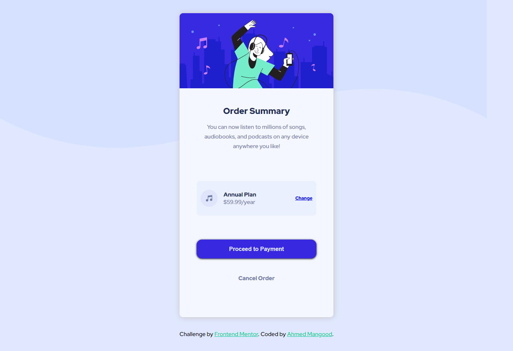

# Frontend Mentor - Order summary card solution

This is a solution to the [Order summary card challenge on Frontend Mentor](https://www.frontendmentor.io/challenges/order-summary-component-QlPmajDUj). Frontend Mentor challenges help you improve your coding skills by building realistic projects. 

## Table of contents

- [Overview](#overview)
  - [The challenge](#the-challenge)
  - [Screenshot](#screenshot)
  - [Links](#links)
  - [Built with](#built-with)
  - [What I learned](#what-i-learned)
  - [Continued development](#continued-development)
  - [Useful resources](#useful-resources)
- [Author](#author)

## Overview

### The challenge

Users should be able to:

- View the optimal layout depending on their device's screen size
- See hover and focus states for interactive elements

### Screenshot

### Links

- Solution URL: [solution URL](https://github.com/ahmed-mangood/Front-End-Mentor-05)
- Live Site URL: [live site URL](https://ahmed-mangood.github.io/Front-End-Mentor-05)

### Built with

- Semantic HTML5 markup
- CSS custom properties
- Flexbox
- Mobile-first workflow
- Css Media Query

### What I learned

I learned how to create a , QR code component as well as the practical application on HTML and CSS, and distribute elements using the flex feature, and also control the style based on the screen size using MediaQuery.

### Continued development

I am looking forward to learn more HTML and CSS and more user interface technologies like javascript to be a Frontend developer.

### Useful resources

- [Elzero Web School](https://www.youtube.com/c/ElzeroInfo)
- [MDN Web Docs](https://developer.mozilla.org)

## Author

- Website - [Ahmed Mangood](https://github.com/ahmed-mangood)
- Frontend Mentor - [@ahmed-mangood](https://www.frontendmentor.io/profile/ahmed-mangood)
- Twitter - [@ahmedmngoud7](https://twitter.com/ahmedmngoud7)
